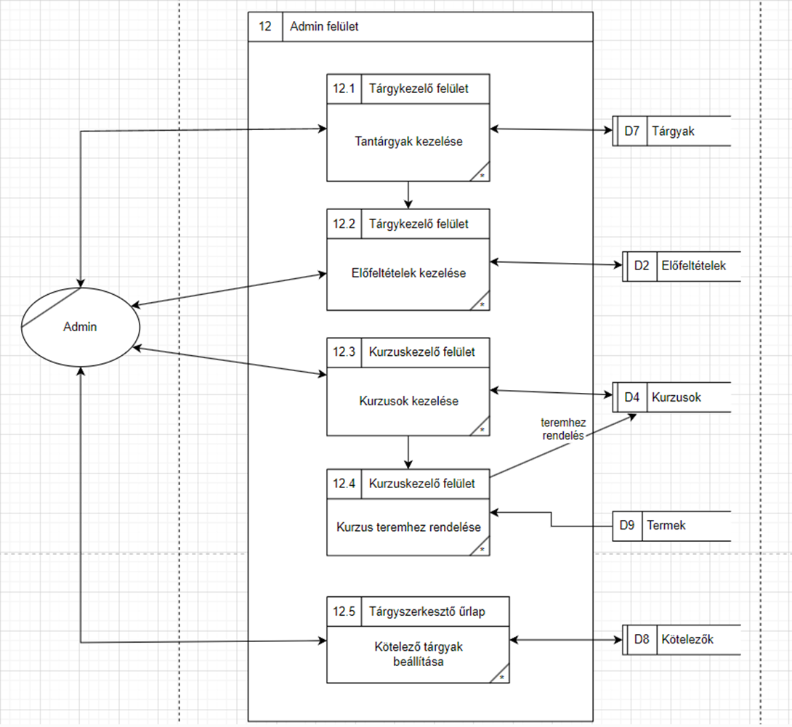
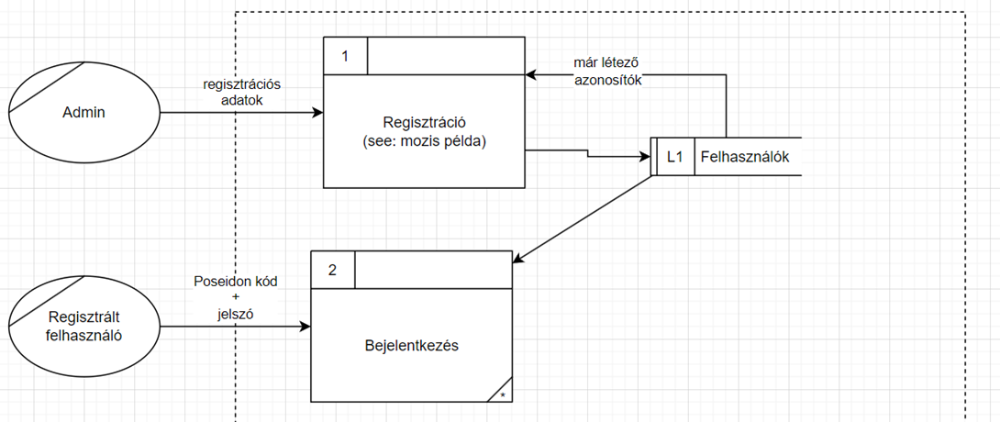
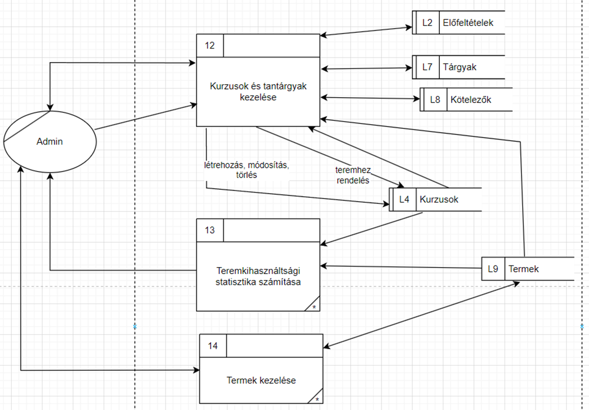

# Poseidon - Elektronikus Tanulmányi Rendszer

Ezen projektmunka az Adatbázis alapú rendszerek nevű kurzus keretében készült el. Feladatunk egy Elektronikus Tanulmányi Rendszer (ETR) elkészítése volt Oracle Database használatával.
A megvalósításra használt programozási nyelv/keretrendszer szabadon választható volt, nekünk a Spring Boot keretrendszerre esett a választásunk.

A projektmunka során felhasznált technológiák:

- Spring Boot
- Bootstrap
- Oracle DBMS

## Feladat szöveges leírása

Az alkalmazás egy Poseidon névre hallgató elektronikus tanulmányi rendszer. Nyilván lehet tartani benne a hallgatókat, oktatókat, szakokat, tantárgyakat és a hozzájuk tartozó kurzusokat, vizsgákat. Lehetőség van ezen adatok kezelésére egy admin felületen. A vizsgákat az oktató kezeli, a hallgató pedig ugyanúgy tudja felvenni, mint a tárgyhoz tartozó egyéb kurzusokat is. Nyilvántartjuk a termeket is, kurzusfelvételnél ellenőrizzük, van-e még hely az adott teremben. Az admin tud oktatót rendelni egy-egy kurzushoz. Miután egy hallgató megkapja a jegyét egy tárgyból, teljesített státuszra változik a felvett tárgy állapota. Amennyiben minden kötelező tantárgyat elvégez, és megvan a kreditszáma, teljesíti a szakot. Ezt a haladást bármikor megtekintheti a felületen. Ezen felül a saját tanulmányi átlagát is láthatja, valamint az évfolyamának statisztikáját. A felhasználó megtekintheti saját órarendjét, láthatja és posztolhat a fórumra, illetve hozzászólást is írhat. Van egy üzenőfal is, ez bejelentkezés nélkül is látható. Az adott évben végzett hallgatók és statisztikáik is ide kerülnek fel. Az admin látja a teremkihasználtsági statisztikát is, ez alapján tudja beosztani a következő félévre a termeket. Vannak jóváhagyásos kurzusok is, ezek „jóváhagyásra vár” állapotban vannak, amíg az oktató jóvá nem hagyja, vagy el nem utasítja a jelentkezést. Kurzusfelvétel előtt az alkalmazás ellenőrzi az előfeltételek teljesítését is. Kurzusokat lezárni, megnyitni az admin tud – tárgyfelvételi időszak -, valamint akkor sem vehető fel egy kurzus, amennyiben már tele van.

## Követelménykatalógus

1. Szakok, kurzusok, oktatók diákok nyilvántartása
2. Kurzusok felvétele
3. Teremkapacitások ellenőrzése (T)
4. Kurzusok kiosztása oktatóknak
5. Kurzusteljesítések kezelése
6. Évfolyam-statisztika
7. Tanulmányi átlag, súlyozott átlag
8. Órarend készítése
9. Fórum
10. Adminisztrátori funkciók
11. Teremkihasználtsági statisztika
12. Tantervi teljesítések (T)
13. Kurzusok konfirmálása az oktatók által (T)
14. Kurzusok előfeltételeinek kezelése
15. Adott évben végzett hallgatók száma, diplomaátlagok
16. Üzenőfal
17. Kurzusok lezárásának, megnyitásának lehetősége
18. Vizsgára jelentkezés funkció, vizsgastatisztika

## Adatfolyam diagram (DFD)

### Fizikai

A DFD 1. szintje:

A DFD 2. szintje:

### Logikai

A DFD 1. szintje:

A DFD 2. szintje:

## EK-diagram

## Az alkalmazás telepítése

0. Az alkalmazás futtatásához szükséges: OracleDB elérése, sqldeveloper, IntelliJ Idea (vagy egyéb Java-t támogató fejlesztőkörnyezet)
1. Csatlakozzon sqldeveloperen keresztül az Oracle adatbázisra
2. Futtassa le az ‘sql’ mappában található DBInit.txt fájl tartalmát az adatbázis létrehozásához (ezután lépjen ki az sqldeveloperből)
3. Nyissa meg az IntelliJ-t vagy a választott IDE-t, és nyissa meg az alkalmazást mint projekt. Ez (IntelliJ esetében biztosan) automatikusan betölti a gradle dependenciáit
4. A UI/src/main/resources/application.properties fájlba írja be az sqldeveloperben is használt felhasználónév/jelszó azonosítót
5. A PoseidonETRApplication main metódusának futtatásával elindítható az alkalmazás, amelyet egy böngészőben a localhost:8080-as URL alatt érhet el.
